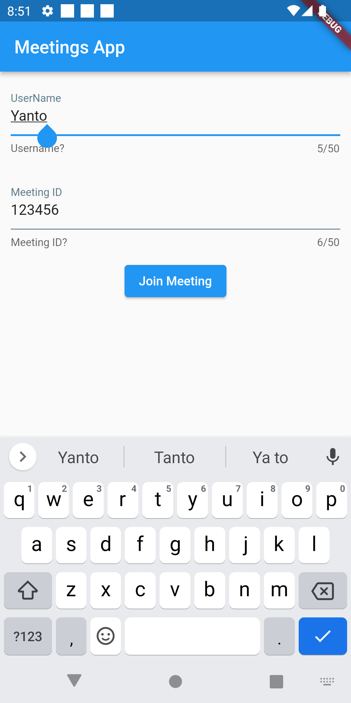
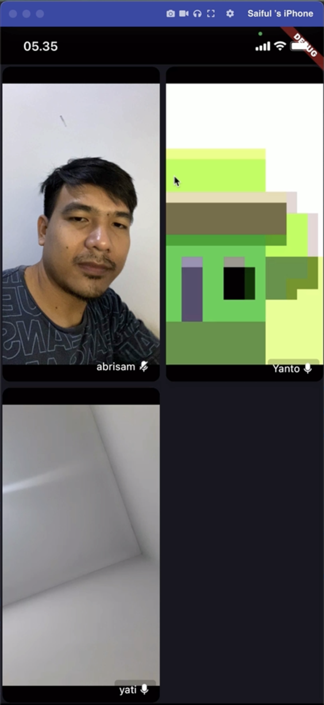

# Flutter Video Conference KIT with Zegocloud

Sample Video Conference with flutter and zegocloud Video Conference Kit

* Get 10,000 free mins month for video conference app: https://bit.ly/3l1mVOJ
* Find out more about ZEGOCLOUD: https://bit.ly/3WXVgLJ
* How to make video conference app: https://bit.ly/3YbHyG6

ZEGOCLOUD allows you to easily build your video conference apps within minutes.

## Youtube Link

https://youtu.be/negT5rHsts4

## Playlist Flutter Intensive Club

https://www.youtube.com/playlist?list=PLQvQbJRJpIZ67MrVzPDOYtAs7wmFjmFUI (https://www.youtube.com/playlist?list=PLQvQbJRJpIZ67MrVzPDOYtAs7wmFjmFUI)

## ScreenShot

| Login         | Room Conference           |
|--------------|----------------|
|  |       |

## Contact:
* Consultation Flutter and Endorse https://t.me/bahri_bhe
* Youtube: https://youtube.com/@codewithbahri
* Github: https://github.com/bahrie127
* Linkedin: https://linkedin.com/in/bahrie
* Roadmap Flutter: https://youtu.be/e2zMJqDBmoY
* Medium: https://medium.com/@bahri

